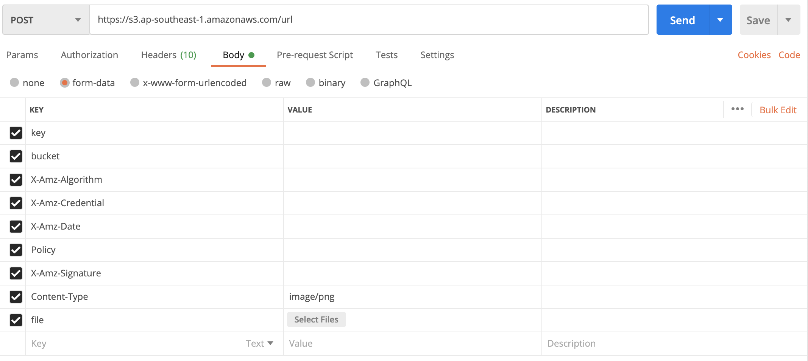
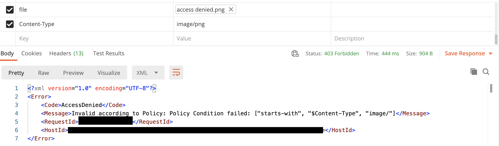

# S3PresignedUrlExample
NodeJS example to gen AWS S3 presigned url

## Run code

```
npm install aws-sdk

node app.js
```

## Using the result url


### getSignedUrl

Just use it straightly.

### createPresignedPost method

When using `s3.createPresignedPost` to generate the upload url, it must uses `POST` `multipart/form-data`.  

Due to we setup a condition, `["starts-with", "$Content-Type", content + "/"]`, it needs to add `Content-Type` attribute in `form-data`.  
 


More important, the `Content-Type` order must be in front of file. Otherwise, it will shows error as following picture.  
Still not clear about this is the behaviors about Postman or AWS policy valdating.
